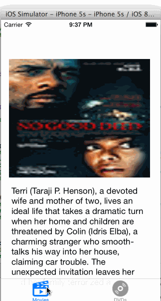

RottenTomatoes App
==================

Completed user stories:

 * [x] User can view a list of movies from Rotten Tomatoes. Poster images must be loading asynchronously.
 * [x] User can view movie details by tapping on a cell
 * [x] User sees error message when there's a networking error using a custom label.
 * [x] User can pull to refresh the movie list. 
	

Walkthrough of all user stories:

GIF created with [LiceCap](http://www.cockos.com/licecap/).
